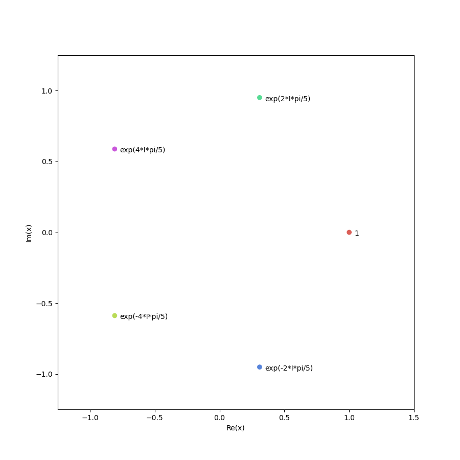
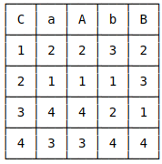
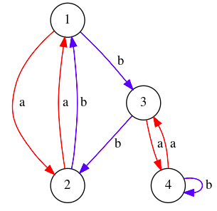

# Teoría-de-Grupos
Repositorio para TFG, realizado por [Alberto Jesús Durán López](https://github.com/thealberteitor).

Implementación de una librería en Python sobre Teoría de Grupos de la asignatura Álgebra II del [Grado en Matemáticas](http://grados.ugr.es/matematicas/) de la [Universidad de Granada](http://www.ugr.es). 

Extensión de la librería de José Luis Bueso y [pedritomelenas](https://github.com/pedritomelenas), basada en la librería de
[Naftali Harris](http://www.naftaliharris.com) y disponible en [Algebra-II](https://github.com/pedritomelenas/Algebra-II) y
[absalg](https://github.com/naftaliharris/Abstract-Algebra), respectivamente.

Un tutorial de uso está disponible en [Jupyter](https://github.com/lmd-ugr/Grupos/blob/master/Tutorial.ipynb).
# Breve Descripción
- Un grupo es un conjunto G no vacío junto a una operación binaria * que verifica los siguientes axiomas: asociatividad, existencia de elemento neutro y existencia de elemento inverso para cada elemento. Por ello, se usarán 3 ficheros.py principales:

- Set: Clase donde se añadirán todas las operaciones a nivel de conjunto.
- Function: Simula la operación binaria definida en nuestro grupo
- Group: Clase principal donde se realizarán las operaciones más importantes:

- Ficheros Adicionales: Se han añadido clases para representar el grupo de Permutaciones, Cuaternios, grupo de las raíces n-ésimas de la unidad y grupo Diédrico.

# Modificaciones

## Set.py
Se han añadido bastantes métodos para que se puedan realizar operaciones a nivel de conjunto:
- Unión, diferencia, intersección, producto cartesiano y diferencia simétrica.

```python
>>> A = Set({1,2,3})
>>> B = Set({2,4})
>>> C = A*B 
>>> print(C)
{(2, 4), (1, 2), (3, 4), (2, 2), (3, 2), (1, 4)}
```


- `cardinality`, `is_finite`: Métodos para calcular la cardinalidad del conjunto y comprobar si este es finito.

- `subsets`: Métodos para calcular los subconjuntos de un conjunto y subconjunto de tamaño *n* . Estas dos métodos serán de mucha utilidad en la clase Grupo ya que simplificará mucho las operaciones.

```python
>>> A.subsets()
[{1}, {2}, {3}, {1, 2}, {1, 3}, {2, 3}, {1, 2, 3}]
>>> A.subsets(2)
[{1, 2}, {1, 3}, {2, 3}]
```


## Function.py
- Se ha mantenido en tu totalidad el formato original, a excepción del operador `__str__` que muestra ahora la función de manera clara y precisa. Se usarán las funciones lambda que ofrece Python.


```python
>>> S = Set({0,1,2})
>>> F = Function(S*S, S,lambda x: (x[0]+x[1])%3)
>>> print(F)
f((0, 1))=1   f((1, 2))=0   f((2, 1))=0
f((0, 0))=0   f((1, 1))=2   f((2, 0))=2
f((0, 2))=2   f((2, 2))=1   f((1, 0))=1
```


## Group.py


### Class Group

Esta clase es la encargada de definir un grupo arbitrario.

- `__str__` y `__repr__`: se modifican para mostrar además los elementos del grupo (siempre que no tengan un orden grande).

- `__init__`: el constructor se modifica para poder definir grupos de varias formas:
 - Definición axiomatizada: Se comprueba que el par (Set,Function) pasado por argumento satisface los axiomas de grupo (asociatividad, identidad e inversos).

```python
>>> S = Set({0,1,2,3})
>>> F = Function(S*S, S,lambda x: (x[0]+x[1])%4)
>>> Z4 = Group(S,F)
>>> print(Z4)
Group with 4 elements: {0, 1, 2, 3}
```

 - Definición en términos de generadores y relatores. Sea un grupo *< X | R >*. Se pasa por argumento el conjunto de generadores *X* y relaciones *R* que definen al grupo. El constructor se encarga de aplicar el **Algoritmo Todd Coxeter** y darle estructura de grupo de Permutaciones al grupo *G*.

```python
>>> gens = ['a']
>>> rels = ['aaaa'] #a^4=1
>>> G  = Group(gensG=gens, relsG=rels)
>>> print(G)
Group with 4 elements: {(), (1, 2, 3, 4), (1, 4, 3, 2), (1,3)(2, 4)}
```

Naturalmente, y aunque la forma de definir ambos grupos anteriores es distinta, son isomorfos:
```python
>>> G.is_isomorphic(Z4)
True
```

 - Por último, se añadirá una tercera forma de definir un grupo. Sea Y un conjunto de elementos, entonces el grupo *G* se definirá como el grupo generado por *< Y >*. En el siguiente ejemplo tomaremos un conjunto con una única permutación, sin embargo, no exigimos que los elementos sean permutaciones.
```python
>>> p = permutation((1,2,3,4))
>>> G = Group(elems=[p])
>>> print(G)
Group with 4 elements: {(), (1, 2, 3, 4), (1, 4, 3, 2), (1,3)(2, 4)}
```

- `is_abelian`: En la primera versión, se comprobaba si el grupo era abeliano en el constructor. Elimino la variable de clase y realizo esta comprobación en un método.

```python
>>> Z4.is_abelian()
True
```

- `identity`: Del  mismo  modo  que  en *is_abelian*,  se  añade  un  nuevo  método para calcular la identidad del grupo.

```python
>>> G.identity()
()
```

- `cosets`:  Método  que  calcula  las  clases  laterales  de  un  grupo *G* sobre  un subgrupo *H*. Se optimiza y se simplifica.


## Permutation.py

- Es la clase que construye el grupo Simétrico y Alternado. 

- `__mul__`: Se modifica y se simplifica el producto de dos permutaciones.

- `__call__`: Este método fallaba cuando se llamaba con la imagen de *n* (longitud de la permutación). Se soluciona este error.

- `__even_permutation__`, `__odd_permutation__`: Métodos para calcular si una permutación es par o impar.

```python
>>> p = permutation((1,3),(5,2))
>>> p.odd_permutation()
False
```
 


## Complex.py
Se ha realizado una implementación del grupo de las raíces n-ésimas de la unidad. Para ello, se ha 
implementado la clase número complejo junto a todos sus operadores que nos permiten sumar, restar, dividir, multiplicar...etc.

- `plot(roots)`: Función que representa las raíces *roots* pasadas como parámetro en el plano complejo.

```python
>>> G = RootsOfUnitGroup(5)
>>> plot(G)
```


## Quaternion.py

Se realiza una implementación de los números cuaternios en el archivo *Quaternion.py*.

- Se han implementado los principales operadores para trabajar con ellos, es decir, representarlos, sumar, restar, multiplicar, dividir, entre otros: `__repr__`, `__str__`, `__call__`, `__add__`, `__iadd__`, `__sub__`, `__eq__`, `__mull__`, `__div__` ...etc. Cabe destacar la importancia del operador `__mul__` ya que gracias a esta sobrecarga ya no hace falta indicar la tabla de multiplicar a la hora de crear el grupo.

- `conjugate`: Calcular el conjugado de un cuaternio.

- `norm`: Norma de un número cuaternio.

- `inverse`: Inverso de un cuaternio.

- `trace`: Traza de un cuaternio.

- Para crear un objeto se puede realizar de dos maneras, mediante su representación vectorial o indicando la letra en cuestión:
```python
>>> i = Quaternion(0,1,0,0)
>>> i2 = Quaternion(letter='i')
>>> i == i2
True
```

- Se puede probar de manera sencilla que las partes imaginarias verifican: 
```python
>>> i = Quaternion(0,1,0,0)
>>> j = Quaternion(0,0,1,0)
>>> j = Quaternion(0,0,0,1)
>>> i*i == j*j == k*k == i*j*k == -1
True
```

- Se verifican el resto de propiedades, como por ejemplo:
```python
>>> q = Quaternion(50,12,3,-9)
>>> r = Quaternion(-8,-2,2,32)
>>> (q*r).conjugate() == r.conjugate()*q.conjugate()
True
>>> (q*r).trace() == (r*q).trace()
True
```


La función que se encarga de crear el grupo de los cuaternios es *QuaternionGroup*, donde únicamente se le ha de pasar por argumento una de las dos representaciones siguientes: "ijk" o "permutations".

```python
>>> Q = QuaternionGroup(rep="ijk")
>>> print(Q)
Group with 8 elements: { 1,  i,  j,  k,  -k,  -j,  -i,  -1}
```

```python
>>> Q2 = QuaternionGroup(rep="permutations")
>>> print(Q2)
Group with 8 elements: {(1, 4, 3, 2)(5, 7, 8, 6), (1, 7, 3,6)(2, 8, 4, 5), (1, 6, 3, 7)(2, 5, 4, 8), (1, 8, 3, 5)(2, 6,4, 7), (1, 2, 3, 4)(5, 6, 8, 7), (1, 5, 3, 8)(2, 7, 4, 6),(), (1, 3)(2, 4)(5, 8)(6, 7)}
```

Aunque la representación del grupo sea distinta, ambos deben ser isomorfos:

```python
>>> Q.is_isomorphic(Q2)
True
```

- QuaternionGroupGeneralised(n): define el grupo generalizado de los Cuaternios, con presentación:
 *Q_n = < a,b | a^n = b², a^{2n}=1, b^{-1}ab=a^{-1} >*. Su elementos serán permutaciones, y claramente cuando n=2 se tendrá el grupo de los Cuaternios Q_2.


```python
>>> Q = QuaternionGroupGeneralised(2)
>>> Q.is_isomorphic(Q2)
True
```


## Diedral.py
Se ha realizado la implementación del grupo diédrico en el archivo *Dihedral.py*. Ahora, un grupo de orden *2n* estará formado por *n* simetrías y *n* rotaciones.

- Se han incorporado diferentes representaciones del grupo: *RS*, *tuple*, *permutations*
 -  RS: R0, R1,..., RN,  S0, S1,..., SN.
 - Tuple: representación mediante tuplas. (representan la matriz del movimiento)
 - Permutations: representación mediante permutaciones de *permutations.py*. 

Todas estas representaciones son equivalentes:
```python
>>> Dr = DihedralGroup(2, rep="RS")
>>> Dt = DihedralGroup(2, rep="tuple")
>>> Dp = DihedralGroup(2, rep="permutations")
>>> Dr.is_isomorphic(Dt)
True
>>> Dt.is_isomorphic(Dp)
True
>>> Dp.is_isomorphic(Dr)
True
```

- En [aquí](https://github.com/lmd-ugr/Grupos/blob/master/test/test_dihedral.png) se puede ver un ejemplo de las llamadas a la tabla de Cayley con las tres diferentes representaciones.


## ToddCoxeter.py

El  de **Algoritmo Todd Coxeter** es un algoritmo que resuelve el *Problema de Palabras* (*Word Problem*) para un grupo *G* mediante la enumeración de clases del grupo cociente *G/H* (a derechas), donde *H* es un subgrupo de *G*.

La descripción del algoritmo se puede encontrar en la memoria del proyecto, la implementación en [ToddCoxeter.py](https://github.com/lmd-ugr/Grupos/blob/master/ToddCoxeter.py) y un tutorial de su uso en [Jupyter](https://github.com/lmd-ugr/Grupos/blob/master/Tutorial.ipynb). 

- `CosetTable`: Crea una instancia de la tabla de clases a partir del archivo pasado por argumento.

- `readGroup`: implementación de una función que nos ayudará a leer los grupos por ficheros. Por orden, se leeran los generadores del grupo *G*, sus relaciones y los generadores del subgrupo *H*. En el directorio *Group* se proporcionaran ejemplos de grupos estudiados.

- `CosetEnumeration`: método principal para llamar al algoritmo y obtener la tabla de clases de *G/H*.

- `schreier_graph`: método que calcula el grafo de schreier resultante a partir de la tabla de clases laterales obtenidas del método anterior `CosetEnumeration`.

- `getGenerators`: a partir del grafo de Schreier no es difícil calcular el número de elementos del grupo. Para ello, calculamos sus generadores de forma recursiva usando este método.


Realizando operaciones con los generadores, se obtendrá el conjunto total de elementos al que le proporcionaremos estructura de grupo. 

- Se usará el *Teorema de Cayley* para representar cada grupo como grupo de permutaciones (usando las funcionalidades de *Permutation.py* y así usar una representación alternativa.


Realizamos un ejemplo de ejecución. Consideramos G = < a,b | a²=1, b³=1, (ab)³=1 >  y el subgrupo H = < ab >. 


```python
>>> f = readGroup("Groups/Libro2.txt")
>>> print(f)
(['a', 'b'], ['aa', 'bbb', 'ababab'], ['ab'])
```

Creamos la tabla de clases y llamamos al método principal, que nos devolverá la tabla de clases laterales.

```python
>>> G = CosetTable(f)
>>> G.CosetEnumeration()
>>> print(G.coset_table())
```


Esta tabla equivale al siguiente grafo de Schreier, que refleja la acción de G sobre G/H.

```python
>>> G.schreier_graph(notes=False)
```


En primer lugar, obtenemos los generadores de Schreier; después, definimos G como el grupo generado
por éstos.

```python
>>> generators = G.getGenerators()
>>> group = Group(elems=generators)
>>> print(group)
Group with 12 elements: {(2, 4, 3), (1, 4, 3), (2, 3, 4), (1, 2, 3), (), (1, 3, 2), 
(1, 3, 4), (1, 2, 4), (1, 2)(3, 4), (1, 4)(2, 3), (1, 4, 2), (1, 3)(2, 4)}
```

Se trata de un grupo no abeliano de orden 12, por ello, debe ser isomorfo al grupo Alternado A_4, grupo Diédrico D_6 o grupo de los Cuaternios Q_2.

```python
>>> A = AlternatingGroup(4)
>>> D = DihedralGroup(6)
>>> Q = QuaternionGroupGeneralised(3)

>>> print(group.is_isomorphic(A))
True
>>> print(group.is_isomorphic(D))
False
>>> print(group.is_isomorphic(Q))
False
```
 


